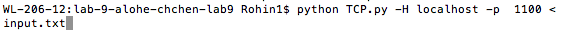
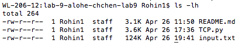
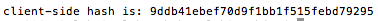
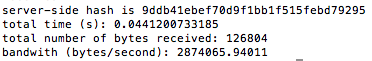

## TCP in Python: implementation notes

### How to build and run the code

The command line will accept input of the form 
```text
python TCP.py [-l] [-p {port number}] [-H {hostname}] [-v]
```

The [-l] tag is for listening. It must be used along with the [-p] tag, which takes in a specific port number. The [-H] tag is to specify a hostname (for the client). Lastly, the [-v] tag runs the programs in verbose method, which means extra debugging information is printed. 

In order to run the server, the following command can be used:
```text
python TCP.py -l -p {port number} [-v]
```

In order to run the client, the following command can be used:
```text
python TCP.py -p {port number} -H {hostname} [-v]
```
### Example Run --- The client

Command used to run the client:


(a) Size of a moderately-large input file (called input.txt). Command used was ls -lh.



(b) Hash value for input.txt. md5 was used.



(c) Ran the client to transmit the file. Results are shown in the server portion below.


### Example Run --- The server

Command used to run the server:


(a) Created output.txt from the data sent by the client. This can be seen in part b's screenshot (because the ls command was called).

(b) Using ls -l, we can verify that the size of the resulting file (output.txt) is the same as input.txt.


(c) We can verify that the hash value for output.txt is the same as the hash value for input.txt.

